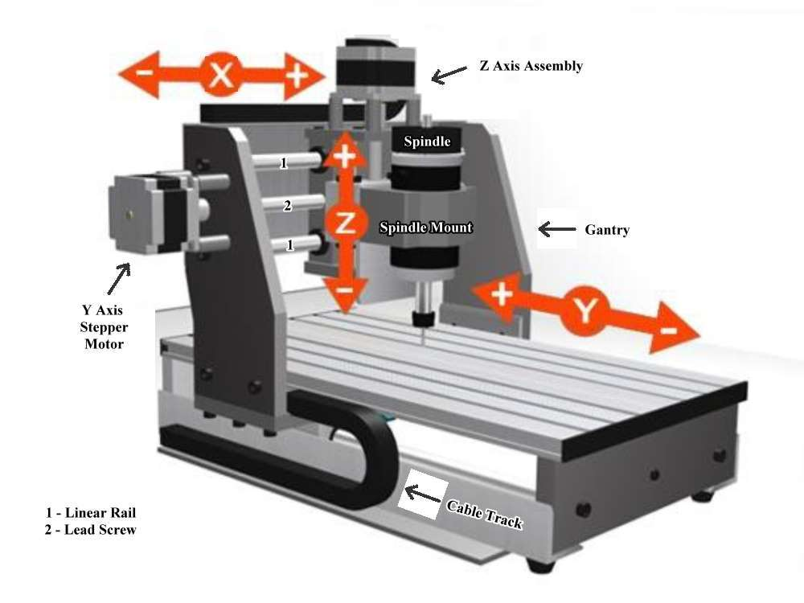
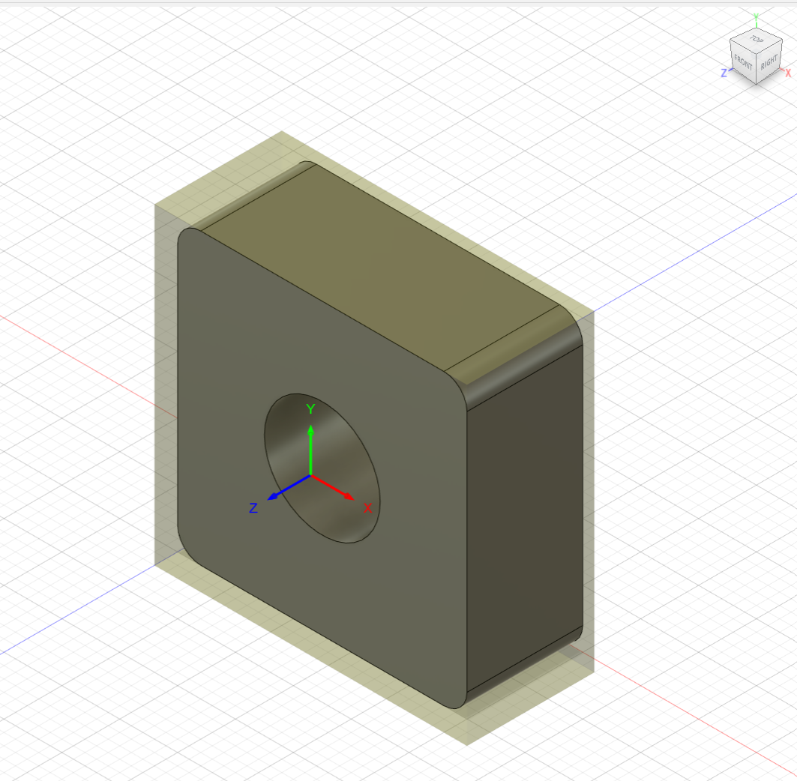
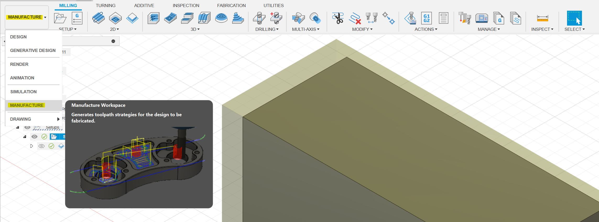
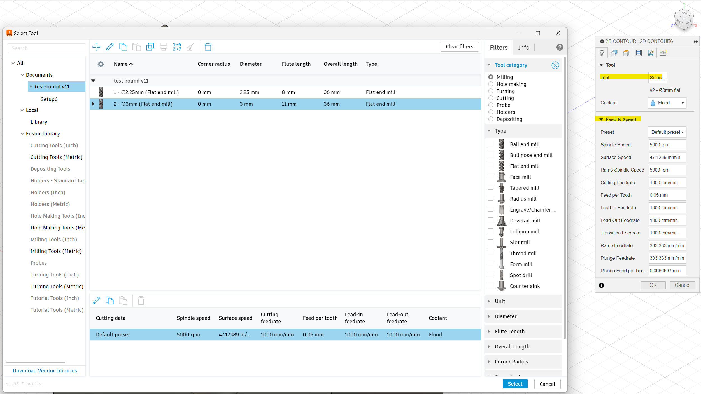
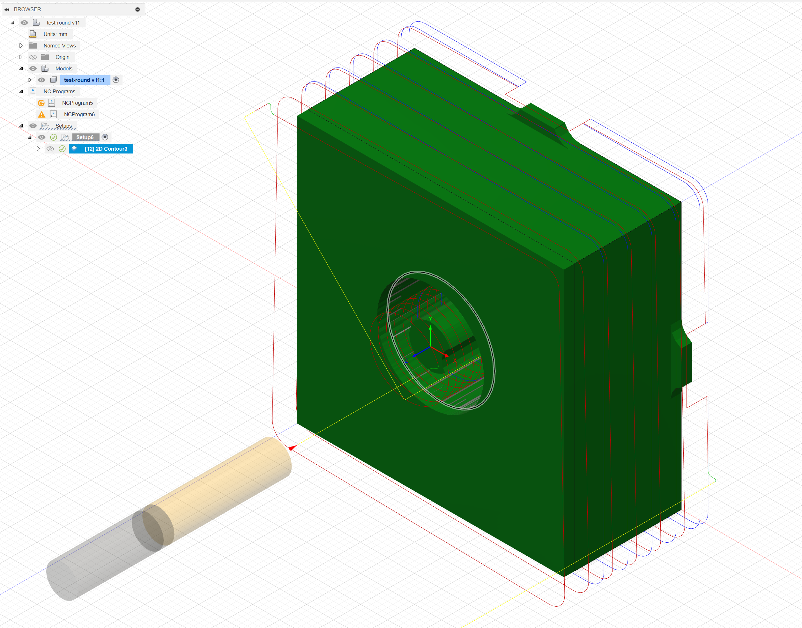
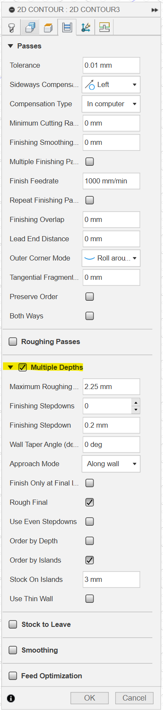
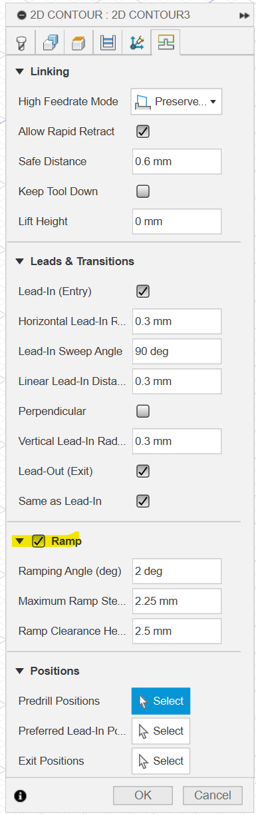
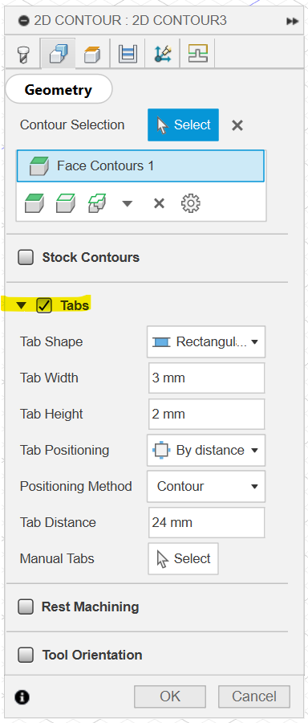
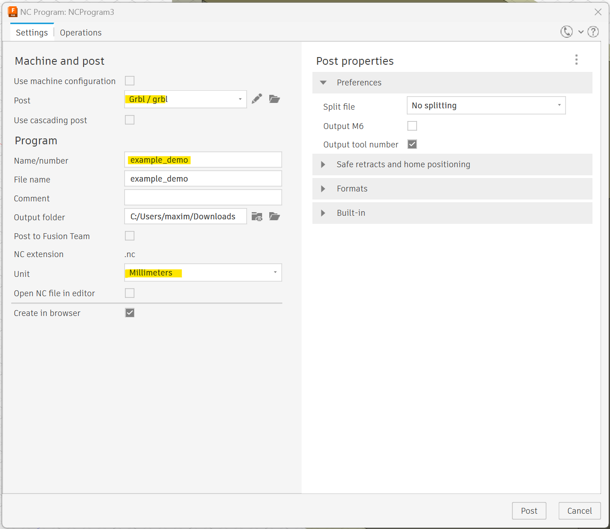
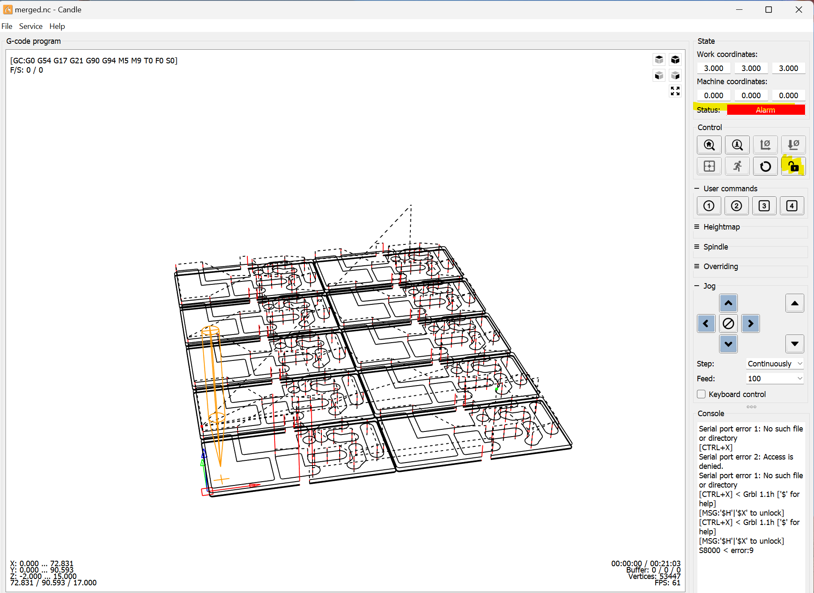

# CNC

Dans ce tutoriel, vous apprendrez à mieux aborder la fabrication d'une piece à l'aide d'une CNC.

## Requirements

Pour ce tuto, il vous faudra:

- être à l'aise avec [Fusion 360](https://www.autodesk.fr/products/fusion-360/overview) (nous l'utiliserons pour le CAM).
- [Candle](https://github.com/Denvi/Candle) (logiciel de contrôle de la CNC).

## La Machine

Le plus important ici est de bien comprendre les contraintes de la CNC.
Voici dans l'idée à quoi ressemblent la CNC et ses axes: 

Comme vous l'aurez compris, cette machine permet de decouper des pièces en 3D dans un bloc de matière. Il est important de prendre en comptes les limitations de la machines: la plupart du temps, vous serez limité par la taille de la fraise que vous utiliserez. Sa taille influra sur la profondeur de coupe (axe Z), la vitesse de coupe et la qualité de la finition.

Nous avons à L'Atelier une ProverXL 4030 avec un kit d'extension qui augmente sa surface de travail à 600x600mm.

## Design 3D

Nous survolerons cette partie, car elle est très similaire à l'impression 3D. La seule différence est que vous devrez penser à la fraise qui découpera votre pièce.

Attention à bien orienter votre pièce dans Fusion 360 pour que la fraise puisse découper la pièce sans problème.

un exemple de création d'objet:

On a ici un exemple de pièce avec la bonne orientation pour la découpe : le cylindre est orienté sur le long de l'axe Z. De plus, la pièce est peu épaisse (10mm) ce qui est découpable facilement en quelques passes.

à la fin de cette étape, passez à la création de l'usinage en allant dans l'onglet `Manufacture` de Fusion 360 comme ci-dessous:

## Préparation de l'usinage

Fusion propose un outil de création d'usinage très complet. Vous pourrez choisir la fraise, la stratégie d'usinage, la vitesse de coupe, etc.

Pour commencer, selectionner la pièce que vous voulez découper. Ensuite, cliquez sur `Setup`. Vous pourrez dans le panneau de droite choisir la taille du stock (le bloc de matière dans lequel vous découpez votre pièce).

Ensuite, il vous faudra créer un nouvel usinage. Pour cela, cliquez sur `2D` ou `3D` selon le type de découpe que vous voulez faire. Un panneau s'ouvrira à droite de votre écran. Vous pourrez choisir la fraise, la stratégie d'usinage, la vitesse de coupe, etc.

Afin de choisir la fraise que vous utiliserez, il faut d'abord en creer une. Pour cela, allez dans l'onglet `Tool Library` et créez une nouvelle fraise. Vous pourrez definir virtuellement toutes les caractéristiques de la fraise que vous utiliserez : diamètre, longueur, vitesse de coupe et bien d'autres. Voici un exemple de fraise qui s'est avérée efficace pour découper du bois sans trop forcer la machine:

Une fois sélectionnée, parametrez votre usinage avec le pannel de droite, puis cliquez sur `OK`. Vous pourrez ensuite visualiser votre usinage pour voir si tout est correct.

On a ici un exemple de l'utilisation de `2d contour` avec l'option `Multiple Depths` (menu `Passes`) pour découper une pièce en plusieurs passes. Ainsi que l'option `Ramp` (menu `Linking`) pour éviter de "plonger" directement dans la matière. Cela permet de réduire l'usure de la fraise et les nuisances sonores. On peut ici apercevoir 6 depths de 2mm chacun (en bleu) et la `ramp` (en rouge).
Des `tabs` ont été ajoutés pour éviter que la pièce ne se détache de la matière lors de la découpe. Cette option peut être trouver dans le menu `Geometry` de l'usinage.

## Exportation du G-Code

Une fois que vous êtes satisfait de votre usinage, clic droit sur le `setup` puis cliquez sur `Post Process` pour exporter le G-Code. 

Voici les paramètres à renseigner pour l'exportation du G-Code:

Attention, Il est important de choisir `Grbl/grbl` dans le menu déroulant `Post` !

## Contrôle de la CNC

Pour contrôler la CNC, nous utilisons Candle. Il vous suffit de brancher la CNC à votre ordinateur, et de l'alumer sur le côté.

### Sécurité - Important

Il est important de bien fixer la matière sur la table de la CNC. Il est aussi important de bien fixer la fraise dans la broche de la CNC. Pour cela, utilisez une clef de 13 et 17.

Un bouton d'arret d'urgence est présent sur la CNC. Il est important de le tester avant de lancer un usinage. Vous devez d'ailleurs l'actionner dès lors que vous devez intervenir sur la machine. Il en va de votre sécurité. De même pour les EPIs. 

Avant de lancer l'usinage, merci de vous assurer qu'une autre personne est présente pour surveiller la machine et actionner l'arrêt d'urgence en cas de problème. (Une personne devra rester à côté de la machine pendant toute la durée de l'usinage).

Actuellement, la CNC n'est pas équipée d'un aspirateur. Il est donc important de regulierement enlever les copeaux de matière qui se forment lors de l'usinage.

En cas de doute, ne lancez pas l'usinage et demandez de l'aide.

### Mouvements manuels

Pour effectuer des mouvements manuels, vous pouvez utiliser les flèches de Candle. Attention, si les fleches ne repondent pas, il est possible que vous ayez atteint un endstop ou que vous sortiez d'un arret d'urgence (`status: Alarm`). Pour regagner le controle, cliquez sur le bouton `Unlock`.

### Tips - Homing

Pour effectuer un `homing` de l'axe Z, renseigner le GCODE suivant dans les paramètres de Candle à l'emplacement `Control -> Probe commands`:
`G91G21G38.2Z-20F100; G92 Z20.0; G0Z5M30`

Le `G38.2` permet de faire un `homing` de l'axe Z. Le `G92` permet de définir la position actuelle de l'axe Z à 20mm. Le `G0Z5` permet de remonter l'axe Z de 5mm.

Il vous faudra ensuite brancher la pince croco de la `Z-Probe` sur la fraise et le socle conducteur sur le bloc de matière. Ensuite, cliquez sur `Probe Z` dans Candle pour effectuer le `homing` de l'axe Z.

Cette opération est importante pour que la CNC sache où se trouve la surface de la matière.

### Lancement de l'usinage

Pour lancer l'usinage, il vous suffit de charger le G-Code dans Candle (`File -> Open`), et de cliquer sur `Start`. Assurez vous de bien être en `status: Idle` avant de demarrer le job. **Merci de respecter les consignes de sécurité ci-dessus**.
