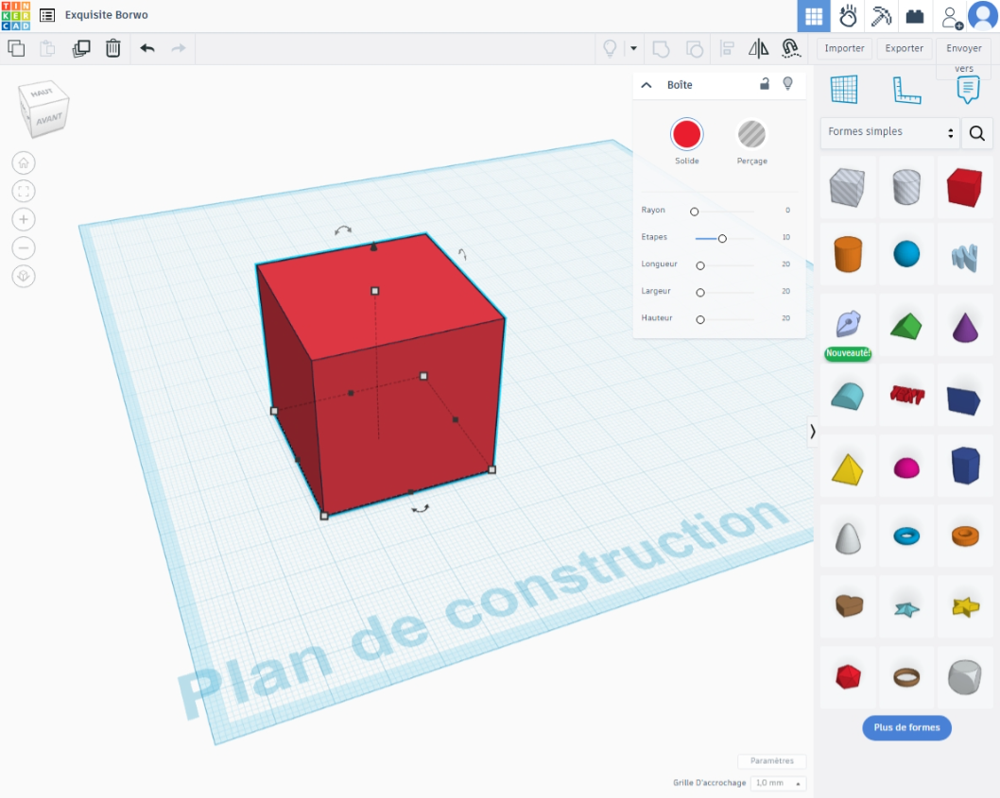
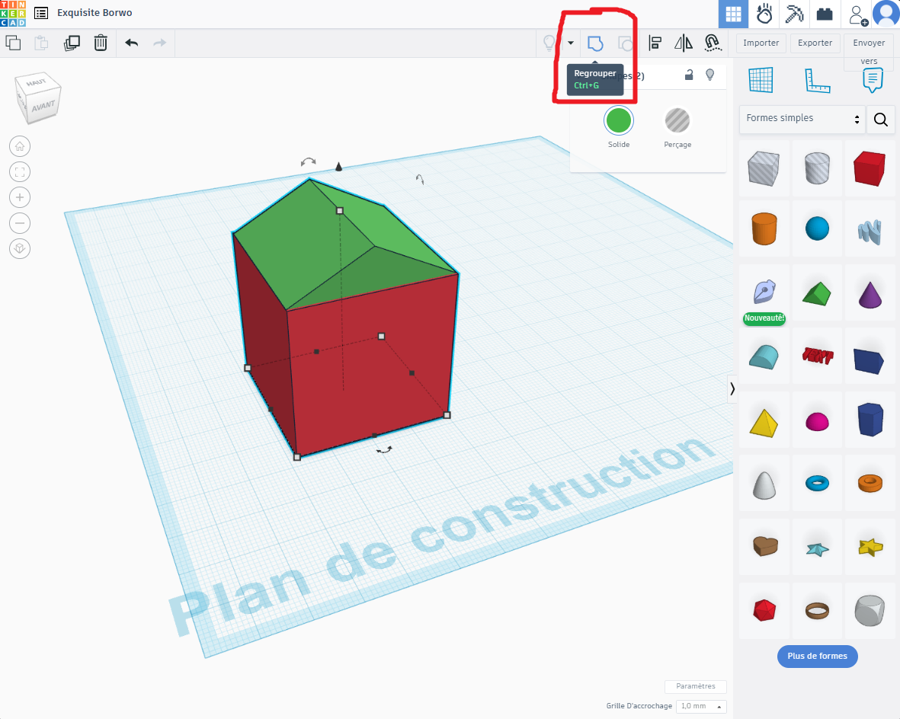
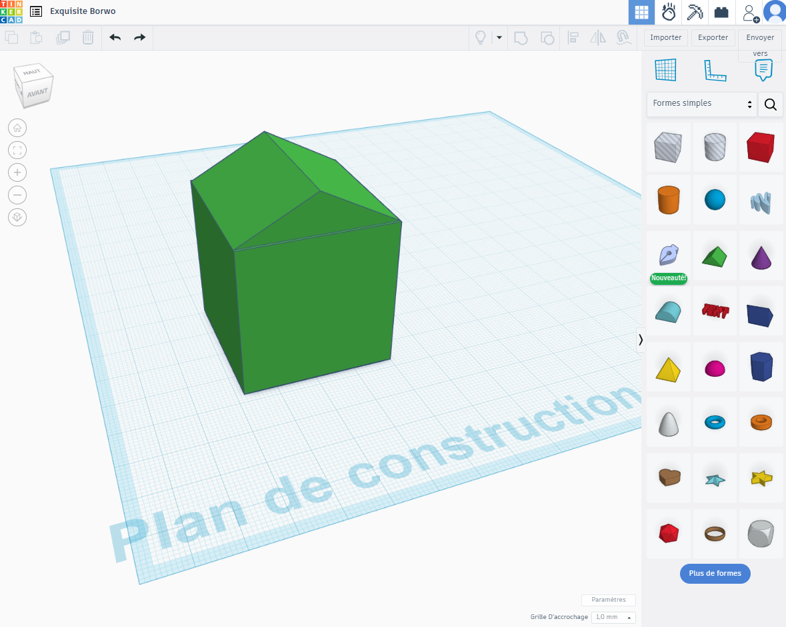
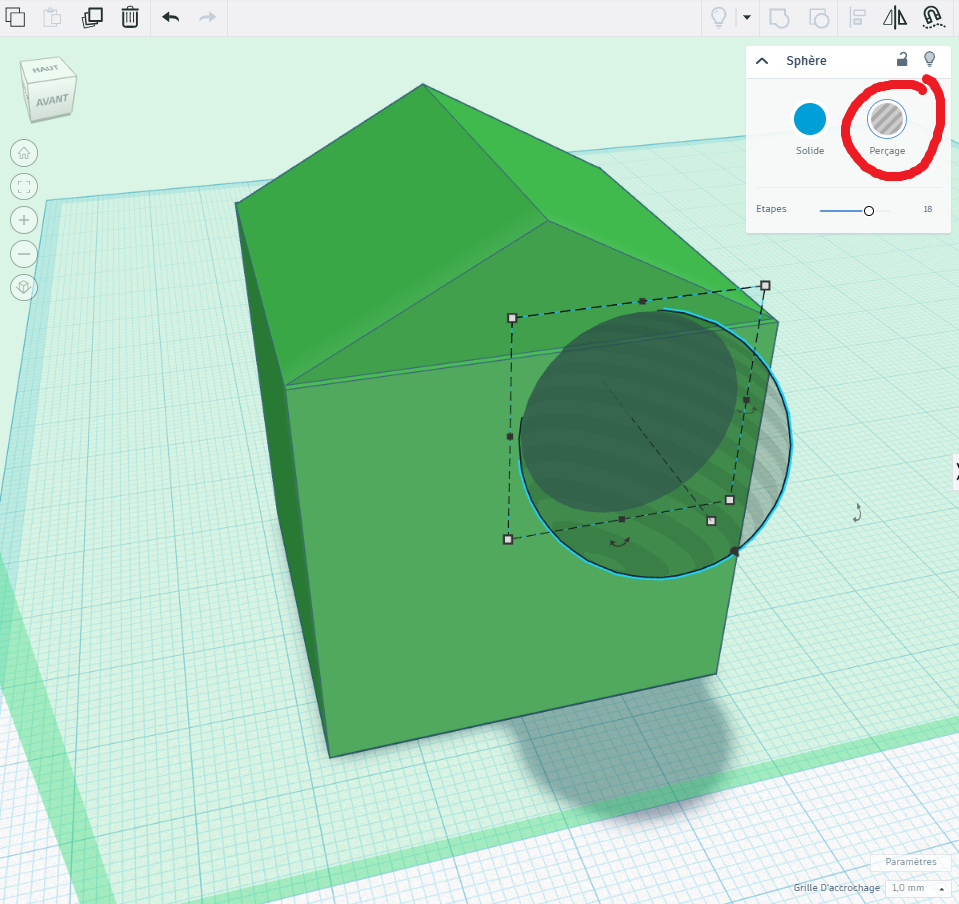

# Introduction à Tinkercad

Bienvenue dans l'univers de la création en 3D ! Aujourd'hui, nous allons découvrir **Tinkercad**, un outil en ligne facile à utiliser pour créer des objets en 3D. Si c'est la première fois que vous créez quelque chose en 3D, ne vous inquiétez pas : on va vous guider pas à pas !

## Qu'est-ce que Tinkercad ?

Tinkercad est un site web qui permet de concevoir des objets en 3D. Mais, qu'est-ce que cela veut dire exactement ?

Imaginez que vous avez de la pâte à modeler. Vous pouvez la façonner, la couper, la coller pour créer des formes comme des cubes, des sphères ou des pyramides. Eh bien, avec Tinkercad, vous faites la même chose, sauf qu'ici, c'est en 3D et sur votre ordinateur !

En plus, une fois que vous avez créé votre objet, vous pouvez l'exporter pour l'imprimer en 3D si vous avez une imprimante, ou simplement pour l'utiliser dans des projets comme des jeux vidéo, des films, ou des applications.

### À quoi ça sert ?

- **Création de modèles pour l'impression 3D** : Si vous avez accès à une imprimante 3D, vous pouvez créer des objets physiques, comme des figurines, des pièces pour des jeux, ou même des prototypes d'inventions.
- **Comprendre la 3D** : Travailler avec des objets en 3D peut vous aider à mieux comprendre comment fonctionnent les objets dans le monde réel, et c’est aussi un excellent moyen de développer votre créativité et vos compétences en technologie.

## Les Contrôles de Tinkercad

Voici les principaux contrôles que vous allez utiliser pour travailler dans Tinkercad. Ne vous inquiétez pas, tout est assez simple une fois que vous avez pris l'habitude !

### 1. **Sélectionner un objet**
   - **Clic gauche de la souris** : Cliquez sur un objet pour le sélectionner. Vous verrez apparaître des poignées autour de l'objet, vous permettant de le modifier.
   
### 2. **Déplacer un objet**
   - **Clic gauche et faites glisser** : Vous pouvez déplacer un objet sélectionné en cliquant dessus et en maintenant le bouton de la souris enfoncé tout en le faisant glisser dans l'espace.

### 3. **Redimensionner un objet**
   - **Poignées de redimensionnement** : Lorsque vous sélectionnez un objet, vous verrez des petites poignées autour de lui. Faites glisser ces poignées pour changer la taille de votre objet.
   - **Maintenir la touche Maj (Shift)** : Pour redimensionner de manière proportionnelle, maintenez la touche **Shift** enfoncée pendant que vous faites glisser les poignées.

### 4. **Faire pivoter un objet**
   - **Clic droit de la souris** : Faites un clic droit sur l'espace de travail et faites glisser pour faire pivoter la vue.
   - **Faire pivoter un objet** : Pour faire tourner un objet sélectionné, cliquez sur l'un des cercles de rotation (qui apparaissent autour de l'objet) et faites-le glisser pour le faire pivoter.

### 5. **Zoomer et dézoomer**
   - **Molette de la souris** : Faites rouler la molette de la souris pour zoomer et dézoomer. Cela vous permettra de mieux voir votre modèle sous différents angles.
   
   - **Alternativement, utilisez les boutons de zoom à droite de l'écran.**

## Créer votre premier objet 3D

1. **Lancez un nouveau projet**  
   Une fois que vous êtes connecté à Tinkercad, cliquez sur le bouton "Créer un nouveau design". Vous serez dirigé vers l'espace de travail où vous pouvez commencer à dessiner.

2. **Ajouter des formes**
   Tinkercad vous offre différentes formes de base : cubes, sphères, cylindres, etc. Cliquez et faites-les glisser dans l'espace de travail pour les ajouter à votre projet.
   {width=80%}

3. **Modifier vos formes**
   Vous pouvez ajuster la taille, la rotation, ou la position des formes avec les outils à l'écran. Essayez de créer un simple objet, comme une boîte ou un cylindre.

4. **Assembler votre objet**
   Une fois que vous avez plusieurs formes, vous pouvez les assembler, les "grouper" pour créer votre propre modèle en 3D. Il suffit de sélectionner les deux formes en maintenant la touche "Maj"(shift) et ensuite de cliquer sur "Grouper" ou **Ctrl+G**.
   Votre objet devrait maintenant être une seule forme de même couleur.

   {width=80%}
   {width=80%}

\pagebreak

5. **Enlever de la matière (Perçage)**
    Vous pouvez aussi enlever de la matière pour créer des formes plus complexes. Pour cela, utilisez l'outil "Percage" et faites-le glisser sur la forme que vous voulez percer. Ensuite, sélectionnez les deux formes et cliquez sur "Grouper" ou **Ctrl+G**.  
    Voilà, vous avez créé un objet en 3D !

    {width=80%}

6. **Répéter et expérimenter**  
   Maintenant que vous connaissez les bases, essayez de créer d'autres objets en combinant différentes formes et en expérimentant avec les outils de Tinkercad. Plus vous pratiquez, plus vous deviendrez à l'aise avec l'outil.

## Conclusion

Tinkercad est un outil amusant et créatif pour commencer à créer en 3D. C'est un excellent moyen de découvrir comment les objets sont fabriqués et de s'amuser à créer ses propres designs. Alors, à vous de jouer !

---

Si vous avez des questions ou si vous avez besoin d'aide pour commencer, n'hésitez pas à demander à un membre de l'équipe de l'Atelier. Nous sommes là pour vous aider à explorer le monde de la création en 3D !
